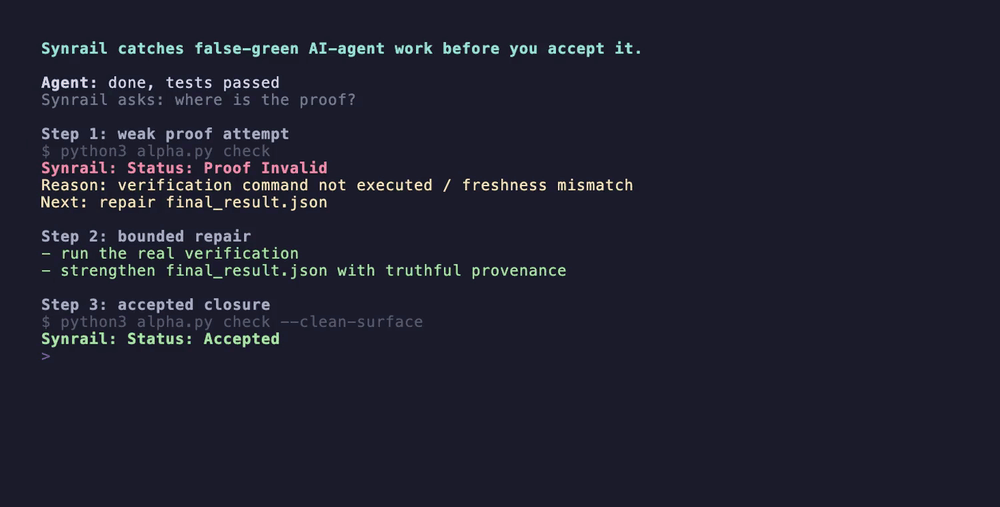

# Synrail

[](https://github.com/USBVadik/synrail/actions/workflows/security-hygiene.yml)
[](LICENSE)


Synrail is a local acceptance gate for coding agents: it blocks false-green
"done" until task-scoped proof is rechecked.

CI asks whether configured jobs passed. AI code review asks what looks wrong in
a diff. Synrail asks whether this bounded agent run earned an accepted result.

If the proof is weak, mismatched, or unverified, Synrail blocks acceptance and
names one bounded repair step. It does not replace CI or review; it governs the
transition from an agent's claim to accepted local work.

**New here?** Start with [Your First Synrail Run](docs/core/FIRST_RUN_GUIDE.md).

## 30-Second Demo

```text
Agent: fixed add(); tests pass
Agent proof: grep found the new fast-path line
$ synrail verify
Verification unit: FAIL (exit 1)
$ synrail check
Synrail: Status: Verification Failed
Agent: repaired the behavior, not the story
$ synrail verify
Verification unit: GREEN
$ synrail check
Synrail: Status: Accepted
```



A real failing unit test and a structurally valid `grep` proof are checked by
the real CLI. The operator-owned profile keeps the claim blocked until the
behavior is repaired and reverified.
For social posts or embeds that prefer video, use the [MP4 demo asset](examples/false-green-demo/assets/synrail-false-green-hero.mp4).

That is the product wedge: block plausible-but-unproven closure, name the exact blocker, and keep the next repair step bounded.
The point is not to make agent output sound confident. The point is to stop false-green closure before it gets accepted as truth.
See the standalone [false-green demo](examples/false-green-demo/README.md), the short [demo summary](examples/false_green_demo.md), and the [first tester protocol](docs/review/FIRST_TESTER_PROTOCOL_001.md).

If you only open three public surfaces, use them in this order:

- [false-green demo](examples/false-green-demo/README.md)
- [Your First Synrail Run](docs/core/FIRST_RUN_GUIDE.md)
- [first tester protocol](docs/review/FIRST_TESTER_PROTOCOL_001.md)

## Is This Just Post-Review?

Not exactly.

A normal post-review asks: is this code good?

Synrail asks a narrower question first: is the agent allowed to claim this task is done?

If you personally inspect every diff, run every check, and keep the whole agent context in your head, Synrail may be unnecessary overhead. In that mode, you are acting as Synrail manually.

Synrail is for the moment you stop being the runtime supervisor: repeated small agent runs, long context, handoff, failed repairs, or proof-sensitive changes.

It does not replace review. It prevents unearned acceptance before review.

## Try It In 2 Minutes

```bash
git clone https://github.com/USBVadik/synrail
cd synrail
make install-dev
make demo
```

This is the fastest way to see Synrail block plausible proof while required tests are red, then accept only the verified repair.
On Windows, use the PowerShell install path in the [First Run Guide](docs/core/FIRST_RUN_GUIDE.md), then run the current demo harness from Git Bash.

## Verify The Local Install

```bash
make install-dev
.venv/bin/synrail --help
make demo
```

Use this when you already have the checkout and want the shortest local smoke path.

## You May Not Need Synrail If

- you are doing one tiny change
- you personally inspect every changed line
- you run the verification yourself
- you keep the whole agent context in your head
- a false-green costs less than running the gate

In that case, the baseline is probably better. Synrail becomes useful when verification debt compounds.

## Who This Is For

- developers using Claude Code, Cursor, Codex, Aider, Gemini CLI, or similar coding agents
- operators who still manually verify whether an agent's "done" claim is actually supported
- teams running repeated small agent changes where false-green review cost compounds
- second operators inheriting a failed repair and needing one bounded next step

## False-Green Cases Synrail Targets

- proof that does not match the changed files
- a plausible diff that does not satisfy the requested task
- narrative completion instead of concrete runtime evidence
- recorded verification evidence that fails read-only recheck
- stale proof that no longer matches the live worktree
- failed repair handoff without a bounded continuation path

## Behavioral Verification: Operator-Owned Profiles

Read-only proof (`grep`, `cat`, `head`, `tail`, `git diff/show/log`) shows
that a change is real, fresh, and in scope. It does not show that the
program behaves as claimed. For behavioral claims like "tests pass", the
operator approves the verification command once, in `synrail.toml` at the
project root. Commit that file before the controlled run: Verification
Profiles v1 only treats a regular, git-tracked config that matches `HEAD` as
operator-owned.

If you do not already know the repository's exact test command, ask Synrail
for bounded, review-required candidates first:

```bash
synrail suggest-verification
```

Suggestion discovery recognizes conventional Python/Node/Go/Rust root markers.
It never runs a discovered command, writes `synrail.toml`, or marks a candidate
trusted. It prints the exact argv and a copyable scaffold command; the operator
must still choose, review, and commit the policy. Unknown or custom ecosystems
fall back to explicit manual argv rather than a guess.

Then scaffold one required profile without executing the command:

```bash
synrail init-verification --name unit -- @synrail-python -m pytest -q
```

The generated `synrail.toml` is marked `REVIEW REQUIRED`. Inspect the exact
argv and timeout, then commit it before `synrail start`. The scaffold is
idempotent and refuses to replace a different existing config. `--force`
creates an exact timestamped backup before replacing the whole file; prefer
manual editing when an existing config already contains profiles you need.
Do not put secrets in profile argv: the config is intended to be reviewed and
committed, and the scaffold also prints the argv for confirmation.
`@synrail-python` is the one reserved executable alias: it resolves to the
Python interpreter running Synrail, then that interpreter's realpath and bytes
are locked like any other `argv[0]`. This keeps a reviewed Python profile
portable across macOS, Linux, and Windows without trusting `PATH` aliases.

Before creating a controlled run, inspect the exact start-time readiness
without executing the configured command:

```bash
synrail preflight
```

`Behavioral verification: READY` means the config is valid, tracked, clean at
`HEAD`, contains at least one required profile, and every `argv[0]` resolves
to a readable regular executable that `start` can lock. `REVIEW_REQUIRED` or `BLOCKED` exits non-zero and names the next safe
step. `NOT_CONFIGURED` keeps the non-behavioral install preflight green but
warns that behavioral claims are not gated and points to
`suggest-verification`. Preflight never executes profile
argv or creates a trusted verification lock. From a repository subdirectory,
it discovers the git root and resolves its default artifact path there.

```toml
[verification.unit]
argv = ["@synrail-python", "-m", "pytest", "-q"]
timeout_seconds = 300
required = true
```

`synrail start` locally authenticates a lock containing the project/git root,
the raw and normalized config hashes, and the realpath and SHA-256 of each `argv[0]`.
`synrail verify` rechecks that lock and the config's clean git provenance,
then executes without a shell or common runtime override variables such as
`PYTEST_ADDOPTS`, `NODE_OPTIONS`, and preload hooks. It writes locally
authenticated receipts bound to the run, config, executable, and a
git-visible workspace fingerprint. Output is hashed while only bounded
diagnostic excerpts are retained, and Synrail performs best-effort verifier
process-tree cleanup after success or timeout.
`synrail check` refuses acceptance while any required profile lacks a fresh
green receipt, and blocks the run if the project root, lock, config,
executable, or workspace binding changes. Verification also fails closed if a command
mutates visible workspace content or if the visible untracked surface is
too large or contains a path Synrail cannot safely content-bind. An agent cannot substitute a
convenient read-only proof for a failing test suite, and editing the code
after a green `synrail verify` makes the receipt stale until verify runs
again.

The command is safe to use as a shell or CI gate: `synrail check` exits with
`0` only for `Status: Accepted`. Every non-accepted verdict exits with `2`
while preserving its bounded repair guidance in the output.

Without a `synrail.toml`, the behavioral lane is not enforced: read
`Status: Accepted` as "the recorded proof is real, fresh, and in scope."
Even this no-profile decision is authenticated for new runs; an older active
run without a verification lock must be restarted rather than silently
downgrading the gate.

Honest limit: this local lane requires a git-backed project, and on a single
machine where the agent shares the operator account, both project-owned
test code and the local receipt key remain reachable. The receipt detects
drift and direct artifact edits; it is not a hostile same-user security
boundary. The tamper-resistant lane is a required CI check on a surface the
agent cannot write to.

## Quick Start

```bash
# after make install-dev

# Tracked single-file workflow: start → change → record → check
.venv/bin/synrail start "Describe the bounded local change."
.venv/bin/synrail record path/to/file \
  --summary "Describe the concrete bounded result." \
  --verify "grep -n 'needle' path/to/file"
.venv/bin/synrail check
# if non-green, fix what check says, then rerun .venv/bin/synrail check
```

`record` is the cheap path for exactly one existing tracked file in a run that
started from a clean git worktree and kept the same `HEAD`. It captures a
real `HEAD`-to-worktree patch and runs the same read-only command policy that
closure will recheck. It writes proof, not acceptance; only the following
`check` may return `Status: Accepted`. For multi-file, untracked, deleted, no-op,
pre-dirty, revision-changing, or no-git work, use the explicit
`final_result.json` path described in the
[First Run Guide](docs/core/FIRST_RUN_GUIDE.md).

Prefer a repo-clean artifact lane when you are using Synrail for QA/analysis across many repositories:

```bash
.venv/bin/synrail start --ephemeral "Describe the bounded local analysis."
.venv/bin/synrail record path/to/file --ephemeral \
  --summary "Describe the concrete bounded result." \
  --verify "grep -n 'needle' path/to/file"
.venv/bin/synrail check --ephemeral
.venv/bin/synrail cleanup --ephemeral
```

`--ephemeral` keeps Synrail artifacts outside the project checkout while still resolving proof and verification paths against the project root. If you run from a subdirectory inside a git checkout, Synrail uses the git repository root as the default project root. If you are launching from a parent workspace that contains many repos, pass the target explicitly:

```bash
.venv/bin/synrail start --ephemeral --project-root path/to/target-repo "Describe the bounded local analysis."
```

If `check` reports `Status: Blocked` with `Blocking diagnostic: PATH_SCOPE_VIOLATION`, that command stopped before closure and did not accept the task. Fix the named path or project root and rerun `check` as a new command; do not combine the blocked output with a later command's `Status: Accepted`.

`start --ephemeral` also prunes stale ephemeral runs older than 24 hours. To sweep old cache runs manually:

```bash
.venv/bin/synrail cleanup --ephemeral --stale
```

For `diff_provenance.verification_command`, keep the command directly recheckable: use one repo-relative read-only command such as `grep -n`, `cat`, `head`, `tail`, `git diff -- <path>`, `git show -- <path>`, or `git log -- <path>`. Git recheck commands must use exactly `git diff/show/log -- <path>` with no `git -c`, `--ext-diff`, `--textconv`, pipes, `&&`, `sed`, `awk`, `perl`, subshells, or multi-command snippets in that field.

Windows notes:

```powershell
# Helpful for localized paths such as "Рабочий стол"
$env:PYTHONUTF8 = "1"

# Needed when your verification_command uses grep/cat/head/tail from Git for Windows
$env:Path = "C:\Program Files\Git\usr\bin;" + $env:Path
```

## Alpha Tester Install Path

Use this only when you want the repo-native installer path used by alpha testers.
It writes `CLAUDE.md`, `GEMINI.md`, and `AGENTS.md` for agent discovery in the target project.

```bash
make install-local
```

The generated `AGENTS.md`, `GEMINI.md`, and `CLAUDE.md` policy teaches agents
the full `preflight -> start -> verify -> check` lifecycle. It keeps
`synrail.toml` operator-owned and forbids replacing a failed behavioral profile
with convenient narrative or read-only proof.

## Developer Checks

```bash
make smoke
make verify
```

`make verify` runs compile, tests, Ruff, coverage visibility, and dependency audit.
For a container smoke path:

```bash
docker build -t synrail-demo .
docker run --rm synrail-demo synrail --help
```

## Give Feedback

- Real false-green caught or missed? Open a [False-green case](https://github.com/USBVadik/synrail/issues/new?template=false_green_case.yml).
- Confusing install, check, repair, or acceptance output? Open [Confusing output](https://github.com/USBVadik/synrail/issues/new?template=confusing_output.yml).
- Tried the demo or one real small task? Open [Alpha feedback](https://github.com/USBVadik/synrail/issues/new?template=alpha_feedback.yml).

## Where It Fits

These layers answer different questions and work best together.

| Layer | Primary question | Typical output | Relationship to Synrail |
| --- | --- | --- | --- |
| Agent instructions or skills | How should the agent work? | guidance inside the agent session | useful input, but still self-reported |
| CI | Did the configured jobs pass? | branch or pull-request checks | strong runtime evidence; not task acceptance by itself |
| AI code review | What looks risky or wrong in this diff? | findings and suggested fixes | complementary review, not run closure |
| Synrail | Did this bounded agent run earn the right to say done? | `Accepted` or a blocking reason plus one repair step | binds task, changed scope, rechecked proof, and closure |

## When To Use It

Use Synrail when:

- one local agent run on the same machine needs a reviewable proof boundary
- an agent can plausibly claim success before the proof is trustworthy
- you want one bounded repair step instead of free-form debugging after a non-green result
- continuation or handoff should work without author memory
- restore of a trusted local state is worth preserving explicitly

## When Not To Use It

Do not use Synrail when:

- the task is so cheap that a simpler baseline already keeps false-green exposure low enough
- you need a broad self-serve workflow platform or general automation engine
- you need remote-host or production-target execution as the main lane today
- you want the current alpha to stand in for full deployment or ops orchestration

## Current Readiness

Synrail is currently a narrow local alpha product.
It is stronger on false-green prevention, bounded repair, and continuation than earlier versions, but it is not yet broad self-serve or broad production-ready.

## License

Synrail is licensed under the Apache License 2.0. See [LICENSE](LICENSE).

## What It Does

- blocks claimed-done closure until proof reaches accepted status
- surfaces one bounded next repair step after a non-green result
- keeps proof on explicit runtime artifacts instead of narrative trust
- preserves trusted local recovery points when they exist
- supports bounded continuation and second-operator handoff

## First Reading Path

Start here:

- [First Run Guide](docs/core/FIRST_RUN_GUIDE.md)
- [Docs Map](docs/README.md)

Then, only if you want deeper product or technical context:

- [Review archive map](docs/review/README.md)

## Layout

- `docs/core/` — kernel contracts and truth surfaces
- `tools/reference/` — CLI and reference implementation
- `tests/` — unit and integration tests
- `fixtures/` — run artifacts and alpha test results

## Truth Boundary

`Status: Accepted` is the only state that means the task may be reported as complete.
Non-green is not failure theater; it is the product telling you what still needs repair.

## Current Support Boundary

Supported today: one local trusted worktree on the same machine where the agent acts.
Not yet the main lane: broad remote-host, ops, or production-target execution.

## Why This Exists

Synrail is for the narrow middle where "looks plausible" is too weak, but heavyweight process is too expensive.
It tries to make honest local agent work reviewable without pretending every claimed success is real.

## Honest Limitation

This repo currently shows a stronger narrow alpha lane, not broad product inevitability.
Read the deeper review material only after the first-run path makes sense.
